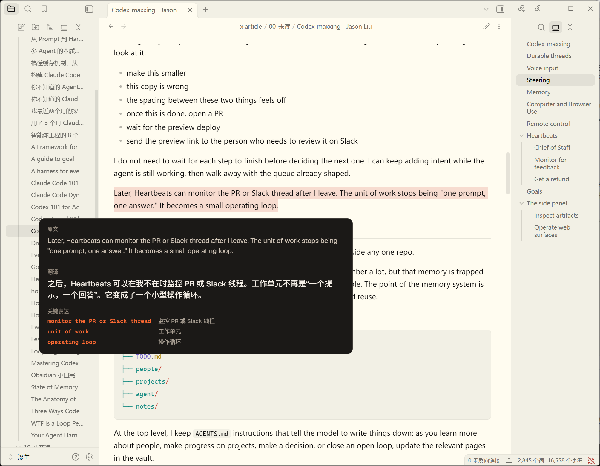
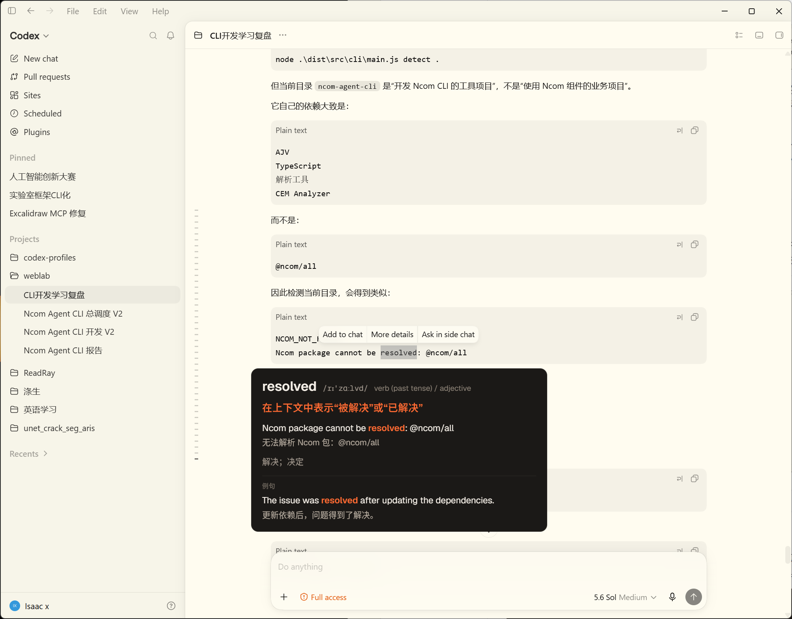
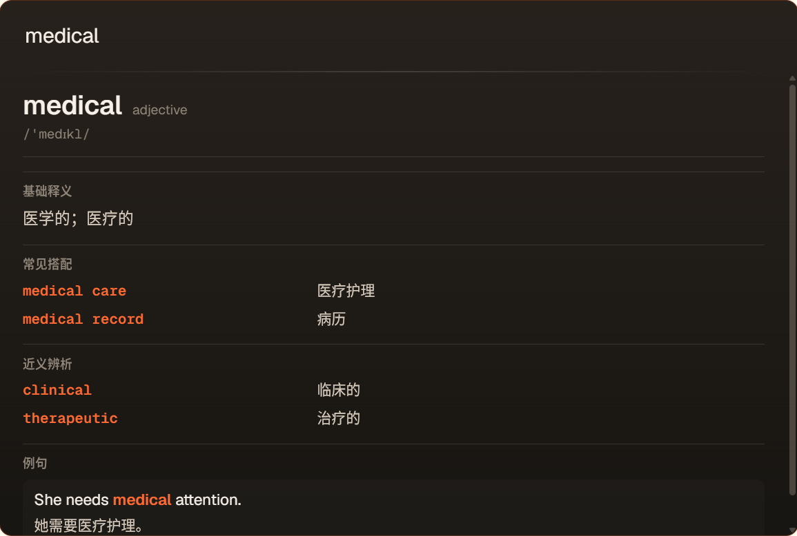
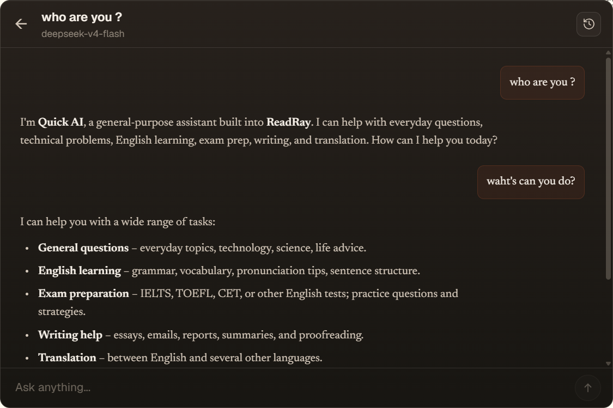
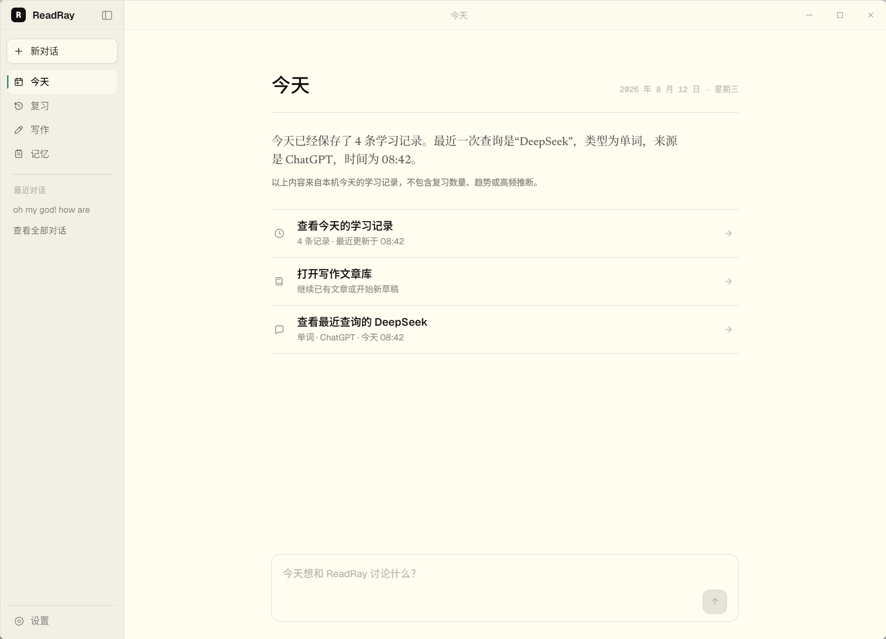
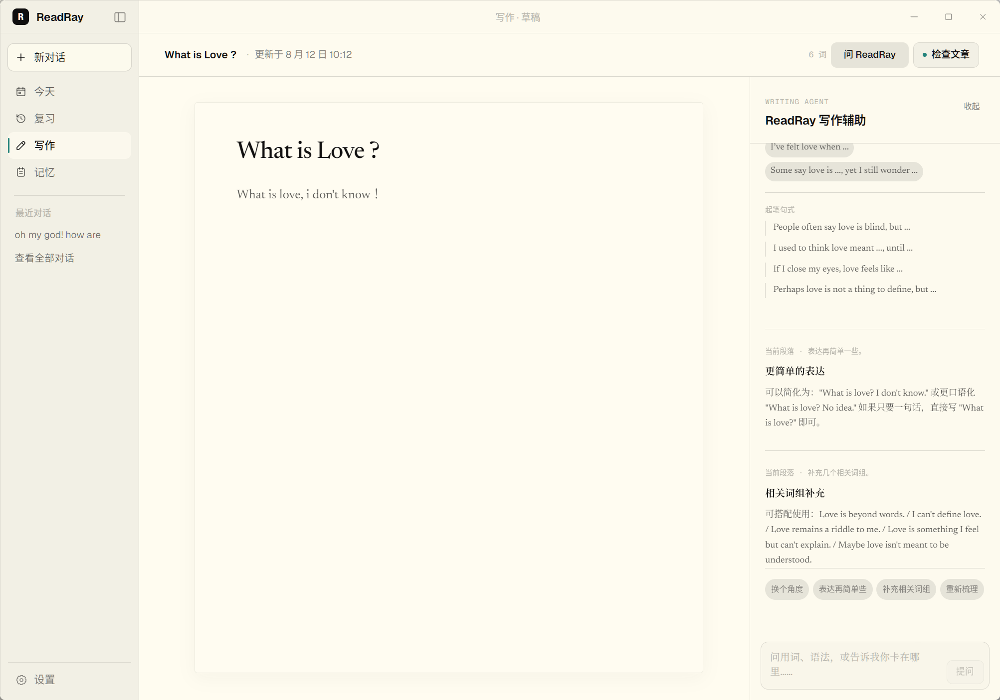
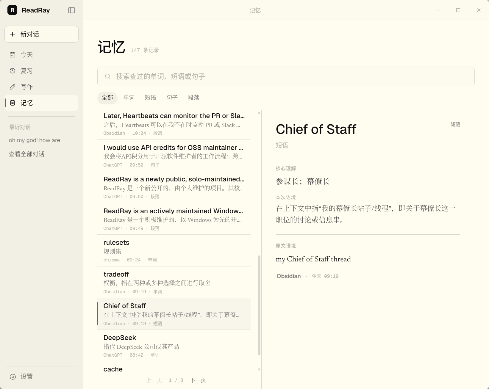
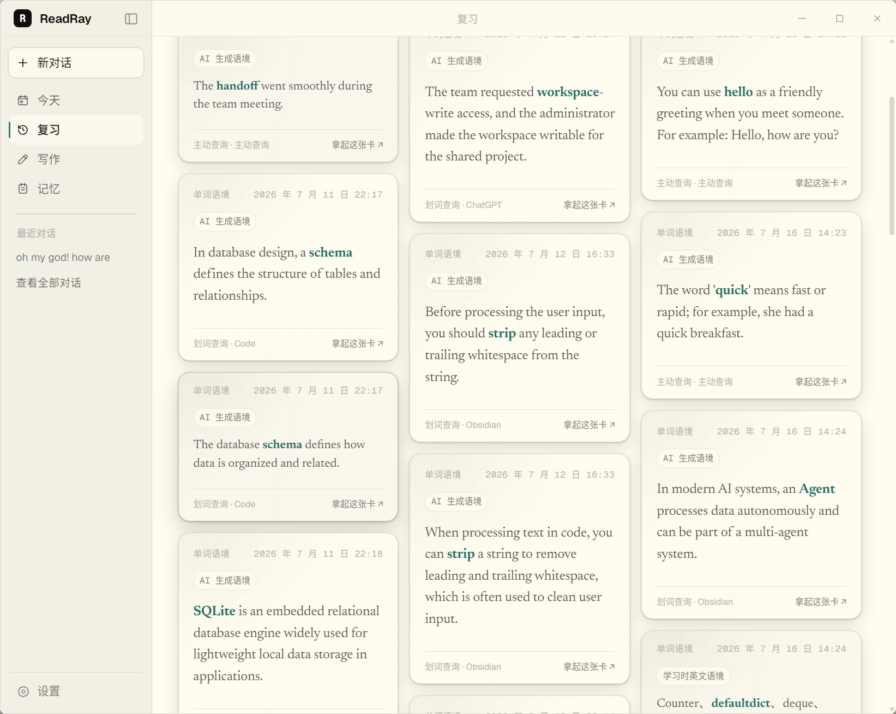

<h1 align="center">ReadRay</h1>

<p align="center">
  把真实阅读变成可解释、可积累、可复习的英语学习过程。
</p>

<p align="center">
  
  
  
  
  
  
</p>

<p align="center">
  <a href="#产品预览">产品预览</a> ·
  <a href="#核心能力">核心能力</a> ·
  <a href="#本地开发">本地开发</a> ·
  <a href="#项目状态">项目状态</a>
</p>

<p align="center">
  
</p>

ReadRay 是一个 Windows 优先、本地数据优先的英语学习 Agent。它从用户正在阅读、对话和写作的真实内容出发，提供划词解释、快捷查询、Quick AI、写作辅助、学习记忆与复习闭环，并把分散的查询逐步沉淀为可追溯的个人学习记录。

它不是一个独立于工作流之外的单词本：用户可以在支持 Windows UI Automation 的应用中选中内容，直接获得解释；也可以回到主应用继续写作、检索历史记录和复习真正遇到过的表达。

## 产品预览

### 划词查询

在正在使用的 Windows 应用中选中单词、短语、句子或段落，ReadRay 会根据内容类型生成相应的解释卡。段落解释保留原文、翻译和关键表达；单词查询提供词性、音标、语境释义、搭配、近义辨析与例句。

<table>
  <tr>
    <td width="50%" align="center"></td>
    <td width="50%" align="center"></td>
  </tr>
  <tr>
    <td align="center">在 Obsidian 中解释真实阅读段落</td>
    <td align="center">在 Codex 中查询单词的上下文含义</td>
  </tr>
</table>

### 快捷查询与 Quick AI

通过全局快捷键唤起轻量浮窗。直接输入单词可快速查询；按 `Tab` 切换到 Quick AI 后，可以继续进行英语学习、写作、翻译或通用问答。浮窗与主应用会话相互隔离，同时共享统一的桌面生命周期与安全存储边界。

<p align="center">
  
</p>

<table>
  <tr>
    <td width="50%" align="center"></td>
    <td width="50%" align="center"></td>
  </tr>
  <tr>
    <td align="center">快捷查询：释义、搭配、辨析和例句</td>
    <td align="center">Quick AI：支持流式输出的独立多轮对话</td>
  </tr>
</table>

### 主应用：今天、写作、记忆与复习

ReadRay 主应用把查询之后的学习过程连接起来：今天页汇总本机当天的学习动态并提供常用入口；写作页提供与当前文章和选区相关的反馈；记忆页统一检索真实学习记录并保留来源；复习页从这些记录生成可追溯的复习卡片。

<table>
  <tr>
    <td width="50%" align="center"></td>
    <td width="50%" align="center"></td>
  </tr>
  <tr>
    <td align="center"><strong>今天</strong>：查看当天学习概况并快速返回最近内容</td>
    <td align="center"><strong>写作</strong>：围绕文章与当前选区获得写作反馈</td>
  </tr>
</table>

写作支持文章新建、搜索、自动保存、全文检查、选区问答、修改差异对比以及完成版本管理；写作辅助会结合当前段落给出表达简化、相关词组和后续写作方向。

<table>
  <tr>
    <td width="50%" align="center"></td>
    <td width="50%" align="center"></td>
  </tr>
  <tr>
    <td align="center"><strong>记忆</strong>：按单词、短语、句子和段落检索学习记录</td>
    <td align="center"><strong>复习</strong>：从真实学习记录生成带来源的复习卡片</td>
  </tr>
</table>

## 核心能力

- **上下文解释**：通过 Windows UI Automation 获取选区与必要上下文，为单词、短语、句子和段落生成不同结构的解释卡。
- **快捷查询**：无需切换当前应用，通过全局快捷键完成主动单词查询和轻量问答。
- **Quick AI**：支持多轮会话、流式输出、停止、重试、历史恢复和受控 Markdown 渲染。
- **写作闭环**：围绕真实文章提供自动保存、全文检查、选区问答、差异确认和版本管理。
- **学习记忆**：使用本地 SQLite 保存并检索可追溯的学习事件，不以演示 fixture 代替正式数据。
- **复习闭环**：根据真实学习记录生成复习 Feed，支持提示、揭晓、记得/忘了、撤销、来源追溯和卡片质量反馈。
- **Windows 桌面体验**：支持系统托盘、单实例、隐藏启动、主窗口恢复、全局快捷键、开机启动与安全退出。
- **个性化外观**：支持界面字体、学习内容字体、字号与主题设置，并在多窗口之间保持一致。

## 数据与隐私

ReadRay 采用本地数据优先的设计：

- 学习记录、文章、会话和非敏感设置保存在本机 SQLite 数据库中。
- DeepSeek API Key 保存在 Windows Credential Manager，不写入 SQLite、数据库备份或普通日志。
- 数据库备份不包含 API Key。
- 浏览器预览使用的 fixture 与正式 Tauri 数据路径隔离。
- 只有在调用解释、Quick AI 或写作辅助时，完成当前请求所需的内容才会发送给模型服务。

## 技术架构

| 层 | 技术与职责 |
|---|---|
| 桌面运行时 | Tauri 2、Rust、Windows UI Automation、系统托盘与窗口生命周期 |
| 前端 | React、TypeScript、Vite |
| 正式数据 | SQLite、版本化迁移、typed Rust commands |
| 模型服务 | DeepSeek，共用 HTTP 客户端与统一用量记录 |
| 凭据 | Windows Credential Manager |
| 测试 | Node.js 内置 test runner、Rust unit/integration tests |

正式功能遵循 `Page -> Service -> Repository -> typed Rust command`。React 页面不直接访问 SQLite，也不直接调用模型；异步结果通过数据库 ID、revision、request key 和当前挂载状态进行约束，避免迟到请求覆盖更新状态。

## 本地开发

### 环境要求

- Windows 10/11
- Node.js 与 pnpm
- Rust stable MSVC 工具链
- Microsoft C++ Build Tools 与 Windows SDK
- Microsoft Edge WebView2 Runtime

### 启动项目

```powershell
pnpm install
pnpm tauri dev
```

API Key 可以在应用设置页中配置；首次启动且尚未配置时，主窗口会显示引导卡片，可点击直达“设置 → AI 服务”。开发环境也可以复制 `.env.example` 为 `.env` 并填写 `DEEPSEEK_API_KEY`；真实 `.env` 已被忽略，不应提交到仓库。

### 构建与验证

```powershell
pnpm test:overlay
pnpm test:conversation
pnpm test:review
pnpm test:writing
pnpm test:settings
pnpm build

cargo fmt --manifest-path src-tauri\Cargo.toml --check
cargo check --manifest-path src-tauri\Cargo.toml
cargo test --manifest-path src-tauri\Cargo.toml
```

生成桌面安装包：

```powershell
pnpm release:build
```

该命令生成 Windows x64 NSIS 安装包，通常位于 `src-tauri/target/release/bundle/nsis/`。安装包包含安装目录选择、开始菜单快捷方式、MIT 许可页和 WebView2 bootstrapper；当前版本使用当前用户安装模式，不要求管理员权限。正式发布前仍需在干净 Windows 环境验证安装、升级、卸载、首次配置、快捷键、托盘和核心流程。

## 项目状态

ReadRay 当前发布 **0.1.0 Preview**，应用版本为 `0.1.0`。

- 已完成核心学习链路、写作、会话管理、设置、Windows 桌面生命周期和基于真实学习记录的复习闭环。
- 长期学习者记忆、个性化排序和效果评估仍属于后续阶段，首个 Preview 不承诺这些能力。
- 目前以 Windows 为唯一正式目标。
- Windows 安装包将在 [GitHub Releases](https://github.com/CLAY-bug/ReadRay/releases) 发布；首次启动后按引导卡片进入“设置 → AI 服务”填写并验证 DeepSeek API Key。
- OCR、本地大模型、浏览器插件和 macOS 支持不在当前范围内。

## 参与项目

ReadRay 目前由个人维护，欢迎通过 Issue 提交缺陷、体验反馈和功能建议，也欢迎提交范围清晰、带有验证证据的 Pull Request。

在进行较大改动前，建议先通过 Issue 说明目标、使用场景和预期行为，以便确认功能边界与现有扩展点。

## 许可证

ReadRay 基于 [MIT License](LICENSE) 开源。
